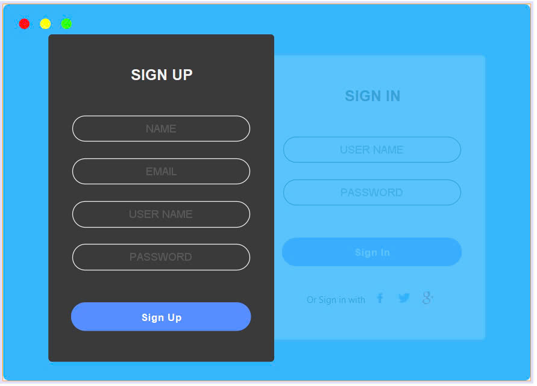
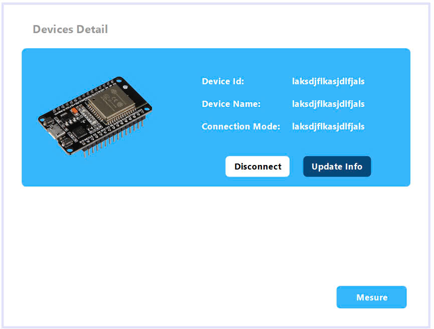

# Alcohol Detector

Hi! My name is Bui Tuan Dung. This project is about using esp 32 together with sensor mq3, buzzer, leds, ... to detect alcohol level in human breath. The data from esp 32 is then sent to a destop app, the user, in this project case, is the police officer will interact with the app to process the data from esp 32. He/She can create fine base on the level of acohol returned by esp 32, get data visualization line graph, ....

# Main board

This mainboard is controled by esp 32, the code for esp 32 is developed using Arduino IDE. I and my team using some basic library like classic bluetooth for connecting to desktop app, analog reading for getting alcohol level from sensor mq-3, ... Code for esp32 is inside [arduino code](./AlcoholDetector-AddedButton.ino/AlcoholDetector-AddedButton.ino.ino)

# Back end

Back end for the desktop app is developed using flask - a python library for quick and simple server application.
Our back end usig JWT for authenticate.
It provides basic api for login, sign up, get device list, registor new device, create fine, get data for visualize, ...
Code for the back end is inside [back end code](./alcohol_service)

# Front end
For front end, we decide to use desktop app coded in java swing.
We use bluecove library, is a bluetooth library for connecting to esp 32.
User interface is friendly and easy to use.

## Login form

## Connectable device list form

## Device detail form

## Device list form

## Visualize data form

## Result form

